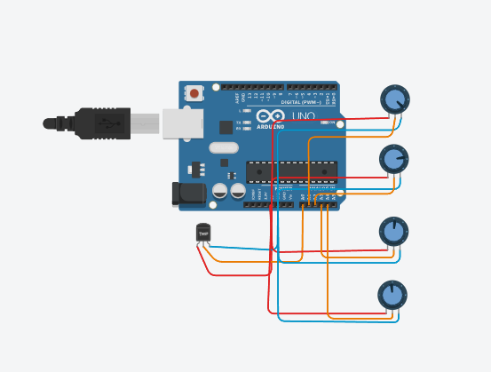
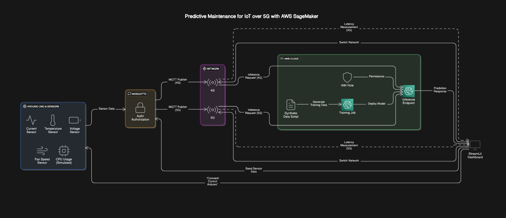
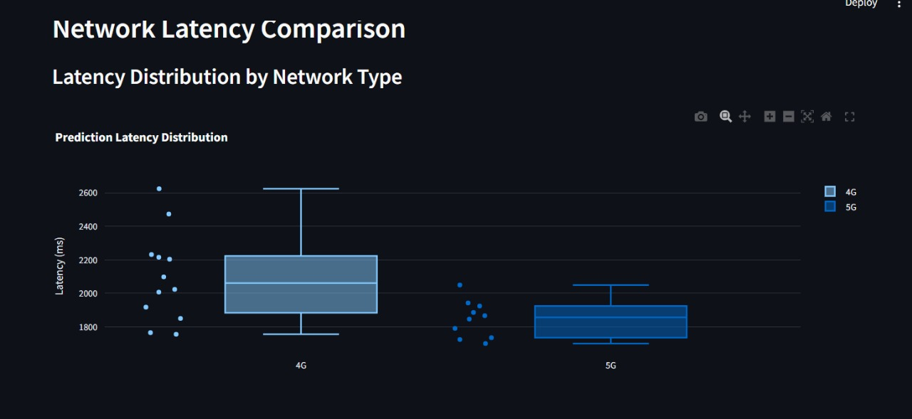
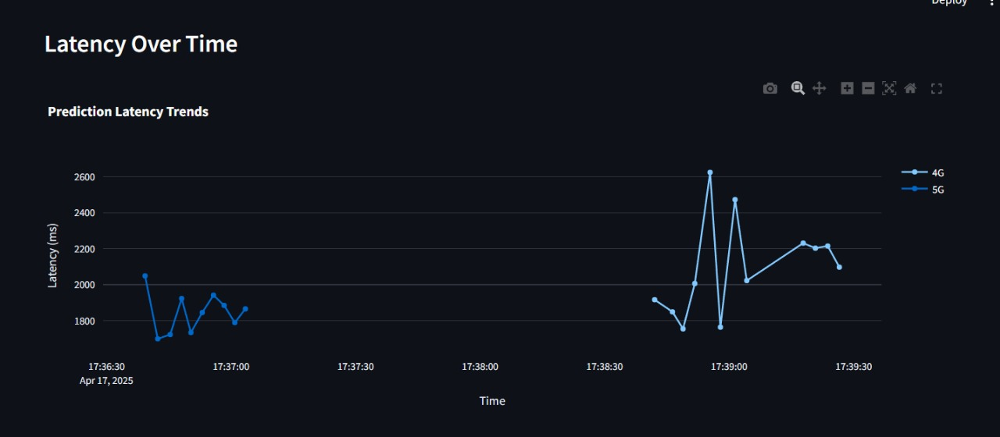

# 📡 Predictive Maintenance for IoT over 5G with AWS SageMaker

This project demonstrates a predictive maintenance system for IoT devices using sensor data, with a focus on network latency performance between 4G and 5G. It utilizes synthetic sensor data to train a machine learning model on AWS SageMaker and evaluates the system's prediction latency over MQTT using both 4G and 5G networks.

## 🧠 Overview

The system performs real-time inference using sensor data from an Arduino-based hardware setup, sending data over MQTT (via Mosquitto) to an AWS SageMaker endpoint. The latency of prediction responses over 4G and 5G networks is measured and compared. Based on our observations, 5G provided a 61.2% improvement in latency compared to 4G.

## 🛠 Hardware and Sensors Used

Arduino UNO

Sensors connected:
- Current Sensor
- Temperature Sensor
- Voltage Sensor
- Fan Speed Sensor
- CPU Usage Sensor (simulated in software)

Hardware circuit was simulated and tested using TinkerCAD.

### TinkerCAD Circuit Diagram

*Circuit diagram showing the Arduino UNO connected to various sensors*

## 📊 System Architecture



*The above diagram illustrates the complete pipeline of our predictive maintenance system, from data collection through sensors to prediction results via AWS SageMaker.*

## 🚀 Project Setup

### Prerequisites
- ✅ AWS Account
- ✅ IAM Role with SageMaker execution permissions
- ✅ Python 3.x installed
- ✅ Mosquitto MQTT broker installed ([Download](https://mosquitto.org/download/))
- ✅ Arduino IDE installed and configured
- ✅ Arduino connected via USB

## ⚙️ Steps to Setup

### 1. Clone the Repo
```bash
git clone https://github.com/IIITV-5G-and-Edge-Computing-Activity/Predictive-Maintenance-for-IoT-over-5G-with-AWS-Sagemaker.git
cd Predictive-Maintenance-for-IoT-over-5G-with-AWS-Sagemaker
```

### 2. Generate Synthetic Data
We generate synthetic sensor readings using a Python script:

```bash
python generate_synthetic_data.py
```

### 3. Train & Deploy Model on AWS SageMaker
Open the main.ipynb Jupyter notebook and execute it:
- Upload your synthetic data (or your own dataset)
- Train an XGBoost model
- Deploy the model as a SageMaker endpoint

📌 **Note:** Save your deployed SageMaker Endpoint name. You'll need it for MQTT predictions.

### 4. Setup MQTT
Install Mosquitto and make sure the broker is running:

```bash
sudo apt install mosquitto mosquitto-clients
sudo systemctl start mosquitto
```

### 5. Arduino Setup
Upload the Arduino sketch:

```bash
# Open and upload this using Arduino IDE
arduino_code.ino
```

### 6. Run the Dashboard
Launch the Python dashboard:

```bash
python app.py
```

### 7. Test & Switch Networks
Use the dashboard to:
- Connect to Arduino
- Toggle between 4G and 5G
- Send sensor data via MQTT
- Record latency

## 📊 Results & Observations

## 📊 Network Performance Comparison

| Network | Avg Latency | Min Latency | Max Latency | Std Dev | Improvement |
|---------|-------------|-------------|-------------|---------|-------------|
| 4G      | 4376.78 ms  | 1818.70 ms  | 12317.42 ms | 3728.78 ms | - |
| 5G      | 1007.80 ms  | 1544.34 ms  | 2150.99 ms  | 198.81 ms | **61.2% better** |

*Note: The 5G network demonstrated a significant 61.2% improvement in performance compared to 4G, with dramatically lower standard deviation (198.81ms vs 3728.78ms), indicating more consistent and reliable connectivity.*

### Dashboard Output

<!--  -->
*The dashboard showing real-time sensor data and latency measurements*

### Latency Comparison Visualization

*Graph showing the latency comparison between 4G and 5G networks*

### Video Explanation
[](https://youtu.be/fzUIbwaSFxA)

## 📎 Files Included
- `generate_synthetic_data.py` – Generates synthetic dataset
- `main.ipynb` – Trains and deploys XGBoost model to AWS SageMaker
- `arduino_code.ino` – Arduino sketch for reading sensor values
- `app.py` – Flask dashboard for visualization and control

## 📬 Contact
For any queries or contributions, feel free to open an issue or reach out.